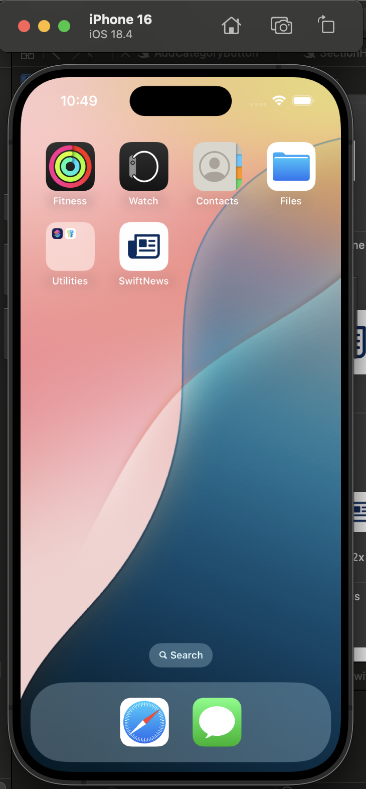
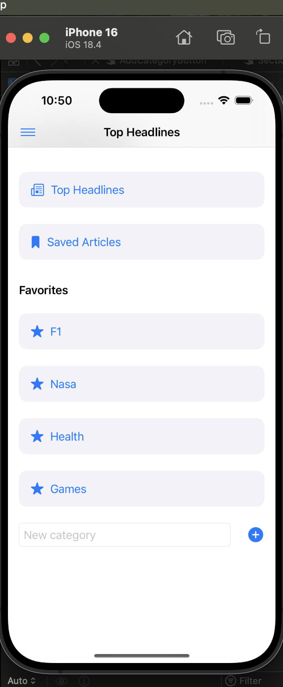

# SwiftNews 📰

SwiftNews is a beautifully designed SwiftUI iOS application that fetches and displays the latest news headlines and articles from various categories using the NewsAPI.

## 📱 App Previews

### Home Screen


### Menu Icon


### Side Menu


## ✨ Features

- 🔥 Fetch Top Headlines for the U.S.
- 📚 Browse news by custom categories (e.g., F1, NASA, Health)
- 🔖 Bookmark/save favorite articles
- 🧹 Clear saved bookmarks easily
- 🧠 Persistent storage using `UserDefaults`
- 🔎 Search functionality for filtering news articles
- 🎨 Modern and responsive SwiftUI interface
- 📂 Organized code structure with MVVM principles

## 🛠️ Tech Stack

- Swift 5
- SwiftUI
- NewsAPI.org
- URLSession for networking
- Codable for JSON parsing
- UserDefaults for local storage

## 🚀 Getting Started

### Prerequisites
- Xcode 15+
- iOS 17+ Simulator or real device
- A free API Key from [NewsAPI.org](https://newsapi.org/)

### Setup
1. Clone the repo:
   ```bash
   git clone https://github.com/yourusername/SwiftNewsApp.git
   cd SwiftNewsApp
   ```

2. Add your NewsAPI key:
   - Open `Info.plist`
   - Add a new key called `API_KEY`
   - Paste your NewsAPI key as the value

3. Run the project:
   - Open `SwiftNews.xcodeproj`
   - Select a simulator
   - Press `Cmd + R` to build and run!

## 📁 Project Structure

```
SwiftNewsApp/
├── Models/
│   └── Article.swift
├── Services/
│   └── NewsService.swift
├── Views/
│   ├── ContentView.swift
│   ├── MainView.swift
│   ├── SideMenuView.swift
│   └── FavoritesView.swift
├── Utilities/
│   ├── IdentifiableURL.swift
│   ├── Constants.swift
│   └── ToastView.swift
└── Resources/
    └── Assets.xcassets
    └── Info.plist
```

## 📜 License
This project is licensed under the MIT License - see the [LICENSE](LICENSE) file for details.

---

Made with ❤️ using SwiftUI.
